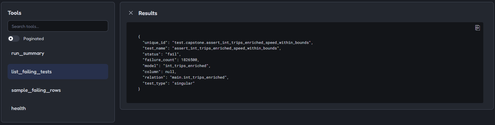

# dbt-mcp

**Ask your dbt project what's wrong, in plain English.** An MCP server that exposes a
dbt project's run state as tools, so an AI assistant composes its own answers to
questions like "is the warehouse healthy?" or "what broke and why?" — no orchestration
written by hand.

Built on [dbt-sentinel](https://pypi.org/project/dbt-sentinel/), which does the artifact
parsing, row sampling and grounded analysis.



## Tools

| Tool | Answers | Uses AI? |
| --- | --- | --- |
| `run_summary` | What failed in the last run, at a glance | No |
| `list_failing_tests` | Each failure: what it guards, rows, test type | No |
| `sample_failing_rows` | The actual offending rows, capped | No |
| `explain_failure` | Root cause, fix and confidence, grounded in those rows | Yes |
| `model_lineage` | What a model depends on, what depends on it, blast radius | No |
| `test_history` | New breakage or long-standing, with trend | No |
| `health` | Config, connectivity, and manifest/warehouse consistency | No |

Only one tool calls a model. Lineage, history and summaries are deterministic lookups —
using an LLM for them would add cost, latency and risk for no benefit.

## Quickstart

```bash
uv sync
export DBT_TARGET_DIR=/path/to/dbt/target
export DBT_DUCKDB_PATH=/path/to/warehouse.duckdb   # or BQ_PROJECT=my-project
export ANTHROPIC_API_KEY=sk-ant-...                # only needed for explain_failure
uv run dbt-mcp
```

Register it with Claude Code:

```bash
claude mcp add dbt-mcp \
  -e DBT_TARGET_DIR=$DBT_TARGET_DIR \
  -e DBT_DUCKDB_PATH=$DBT_DUCKDB_PATH \
  -e ANTHROPIC_API_KEY=$ANTHROPIC_API_KEY \
  -- uv run --directory /path/to/dbt-mcp dbt-mcp
```

Or inspect it interactively:

```bash
npx @modelcontextprotocol/inspector \
  -e DBT_TARGET_DIR=$DBT_TARGET_DIR \
  -e DBT_DUCKDB_PATH=$DBT_DUCKDB_PATH \
  uv run dbt-mcp
```

## What it looks like in use

Asked *"Is my dbt project healthy? If not, what broke, why, and what's the blast
radius?"*, an agent called `run_summary`, `list_failing_tests`, `sample_failing_rows`,
`explain_failure` and `model_lineage` in sequence. None of those were named in the
question — that composition is the point of exposing tools rather than a fixed CLI.

It then did something better than answer: it cross-checked the diagnosis against the
repository, found that the model's source already contained the correct formula, and
concluded the manifest being analysed was a stale snapshot — so the confident,
internally-consistent diagnosis described SQL that was no longer deployed.

That finding produced the staleness guard now in `health`: a manifest older than 24
hours is flagged, because its compiled SQL may no longer match the warehouse. A tool
that can be confidently wrong should say when its inputs are suspect.

## Configuration

| Variable | Purpose |
| --- | --- |
| `DBT_TARGET_DIR` | dbt `target/` directory (required) |
| `DBT_DUCKDB_PATH` | DuckDB warehouse file |
| `BQ_PROJECT` / `BQ_LOCATION` | BigQuery alternative |
| `ANTHROPIC_API_KEY` | Required only by `explain_failure` |
| `SENTINEL_HISTORY_PATH` | dbt-sentinel history database (defaults to `.sentinel/history.duckdb`) |

The server deliberately does not read a `.env` file: MCP clients pass environment
explicitly in their config, so configuration has exactly one source.

## Design decisions

**Why MCP rather than a CLI.** A CLI answers the question you anticipated. MCP tools let
an agent compose answers to questions you didn't — it picks the tools and the order.

**Thin tools, not one god-tool.** Each does one legible thing so a model can reason about
when to use it. The docstrings *are* the interface: they become the descriptions the model
reads when choosing.

**AI only where it earns its place.** Six of seven tools are deterministic. Only root-cause
explanation needs a model.

**Read-only by contract.** The warehouse is opened read-only; this inspects, never mutates.

**Errors are messages, not stack traces.** Missing config returns "DBT_TARGET_DIR is not
set; point it at a dbt target/ directory" — something an agent can act on and recover from.

## Status

M1 and M2 complete: seven tools, verified against a real dbt project via MCP Inspector and
Claude Code, with self-contained tests and CI. Next: a Claude Skill for a recurring
data-quality briefing, and structured logging of tool calls.

## Development

```bash
uv sync --group dev
uv run ruff check .
uv run pytest -v
```

Tests build their own dbt fixtures in a temp directory — no warehouse, no API key, no
sibling repository required.
